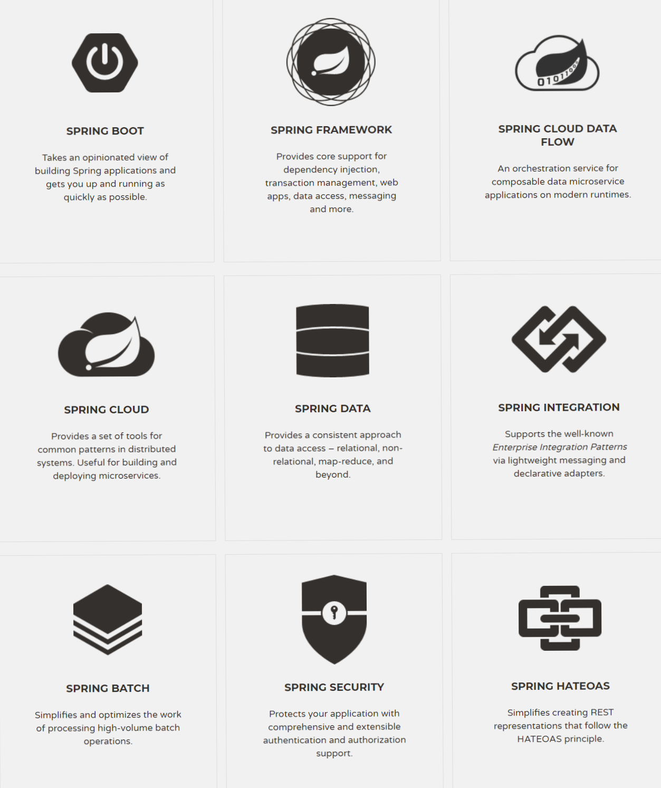

# 初识 Spring Boot

>Spring Boot 究竟是什么? 它是 Spring MVC 的替代品吗? 当我们谈论 Spring 的时候, 我们究竟在谈论什么?

### Spring Boot的诞生

随着`Spring` 框架变得越来越庞大, 内容越来越多, 越来越多的开发者觉得, 搭建一个`Spring` 应用, 即便是一个最基本的, 可运行的应用, 繁杂的配置文件和依赖也消耗了很多程序员的精力, 于是, `Spring Boot` 这个可以自动帮助开发者进行配置, 并且自动讲很多繁杂的依赖进行整合的项目就此诞生。

在理解`Spring Boot` 之前, 我们要先明白一个事实, 那就是:

当我们在讨论`Spring` 时, 我们并不知道我们在谈论什么, 因为`Spring` 严格来说, 包含了太多东西, 绝不仅仅是`Spring MVC` 或是`Spring Boot` 或是`Spring Data` , 这就是为什么有人将`Spring` 称为"全家桶", 所以我们在学习`Spring` 的时候, 一定要明白的学习的具体是`Spring` 中的哪个工程, 这个工程在`Spring` 全家桶中发挥的作用究竟是什么.

我们可以看一下`Spring` 官网中包含哪些工程:



以上九个,  只是`Spring` 全家桶中的部分项目, 事实上, 官方给出的项目有二十二个之多，所以当我们学习一个`Spring` 的具体项目的时候，一定要明白这个项目在整个`Spring` 家族中的定位，或者说，其扮演的角色，比如上图中的`Spring Security` ，这个项目给我们提供了一套搞可定制的安全认证, 权限管理框架, 那我们就知道, 这个项目在`Spring` 家族中扮演的角色就是一个"安全守卫员", 而上图中的`Spring Data` 项目, 则提供了一套和数据层进行交互的框架, 它在一些已经成熟的ORM技术, 比如`Hibernate` , 一些关系型/非关系型数据库, 如`Redis` , `MongoDB` , `Elasticsearch` 等之上, 为我们搭建了一套数据持久层框架，让我们可以更加容易地和数据层/ORM层进行交互，用更少的代码实现更多的事。

我们这本书的主题是`Spring Boot` ，那么它在`Spring` 家族中扮演着什么角色？

### Spring Boot在Spring家族中扮演的角色

`Spring Boot` 的主要职责有二：

1. 帮助我们进行**依赖整合** \(spring-boot-starter\).
2. 帮助我们进行**自动配置** \(约定优于配置\).

关于第一点, 对于一个基于`Maven` 的`Spring` 工程来说, 为了创建一个包含最基本功能的web应用, 我们需要在`pom.xml` 文件中声明如下依赖:

```xml
<dependency>
    <groupId>org.springframework</groupId>
    <artifactId>spring-web</artifactId>
    <version>5.1.0.RELEASE</version>
</dependency>
<dependency>
    <groupId>org.springframework</groupId>
    <artifactId>spring-webmvc</artifactId>
    <version>5.1.0.RELEASE</version>
</dependency>
```

而有了`Spring Boot` 的帮助, `pom.xml` 文件中只需要声明一个依赖项:

```xml
<dependency>
    <groupId>org.springframework.boot</groupId>
    <artifactId>spring-boot-starter-web</artifactId>
    <version>2.0.5.RELEASE</version>
</dependency>
```

你一定已经看到了`spring-boot-starter-web` 这个东西了, 这个依赖本身又依赖了`spring-web` 和`spring-webmvc` 这两个项目，因为我们开发web应用，几乎一定要使用这两个依赖，既然如此，我们把这两个依赖整合到一起，起名为`spring-boot-starter-web` ，这就完成了所谓的**依赖整合**。

所以在这里，`Spring Boot` 就像是一个负责给各种繁多的`Spring` 项目进行分类打包的东西，它毫无疑问大大减少了我们搭建项目初期对依赖的配置，类似的还有：

* spring-boot-starter-data-jpa
* spring-boot-starter-security
* spring-boot-starter-test

很明显, 它们三个分别是整合了关于jpa, security, test的相关依赖, 以`spring-boot-starter-data-jpa` 为例, 它整合了`spring-orm` 、`hibernate-entity-manager` 、`spring-data-jpa` 这三个依赖，可见，`spring boot` 并不只整合`Spring` 自己的项目，还会将一些第三方项目整合进来。

第二点，自动配置。

在写`Spring` 应用的初期，你一定知道，很多东西都需要一个**配置文件**，比如`Hibernate` 需要 `hibernate.cfg.xml` ，`Tomcat` 需要`server.xml` ,  他们都有各自的繁杂配置, 不仅如此, `Spring` 框架本身也需要各种各样的配置, 比如当我们使用`Hibernate/JPA` 时, 我们需要配置`datasource` , `entity manager factory` , `transaction manager` , 我们需要在配置文件中写出如下:

```xml
<bean id="dataSource" class="com.mchange.v2.c3p0.ComboPooledDataSource"
    destroy-method="close">
    <property name="driverClass" value="${db.driver}" />
    <property name="jdbcUrl" value="${db.url}" />
    <property name="user" value="${db.username}" />
    <property name="password" value="${db.password}" />
</bean>
<jdbc:initialize-database data-source="dataSource">
    <jdbc:script location="classpath:config/schema.sql" />
    <jdbc:script location="classpath:config/data.sql" />
</jdbc:initialize-database>
 <bean
    class="org.springframework.orm.jpa.LocalContainerEntityManagerFactoryBean"
    id="entityManagerFactory">
    <property name="persistenceUnitName" value="hsql_pu" />
    <property name="dataSource" ref="dataSource" />
</bean>
<bean id="transactionManager" class="org.springframework.orm.jpa.JpaTransactionManager">
    <property name="entityManagerFactory" ref="entityManagerFactory" />
    <property name="dataSource" ref="dataSource" />
</bean>
<tx:annotation-driven transaction-manager="transactionManager"/>
```

也就是说，我们需要配置很多的`bean` ，而`Spring Boot` 提出了一个新想法解决这个问题：

> 我们能否让`bean` 的配置更加自动化，当我们检测到我们的项目依赖于某个库时，就自动帮助我们去配置这个库需要的`bean` ，当用户自定义了一个`bean` 之后，我们让这个自动配置的`bean` 失效，从而保证了用户的自定义能力不被影响？

所以当我们使用了`Spring Boot` 的时候，`Spring Boot` 检测到我们的项目依赖于`Hibernate` 和`Spring Data Jpa` 时，它就会自动替我们配置上面的那些`bean` ，无需我们手动进行，当然如果我们要配置自己的，只需正常配置即可，一旦配置，`Spring Boot` 就会退让一步，让你的`bean` 起作用。

看到这里，相信大家已经大概明白所谓的“自动配置”\(auto configuration\)是怎么一回事了，在之后的章节中，我们会重点从概念和源码的角度去解释自动配置的实现原理。

### 小结

这一章简要介绍了`Spring Boot` 到底是用来做什么的，明确了它和其它的`Spring` 已有项目并不是取代或替代关系，`Spring Boot` 并没有取代`Spring MVC`，取代`Spring Data` ，而是帮我们更加容易地使用它们，减少我们的繁琐配置过程，让开发更加快速，让我们更加专注于业务层。


