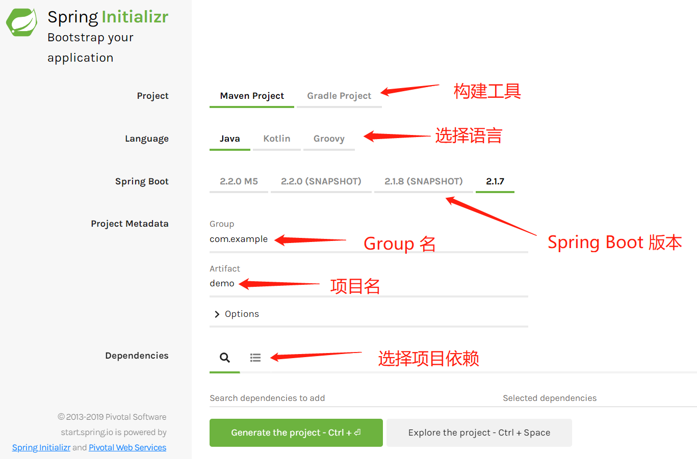
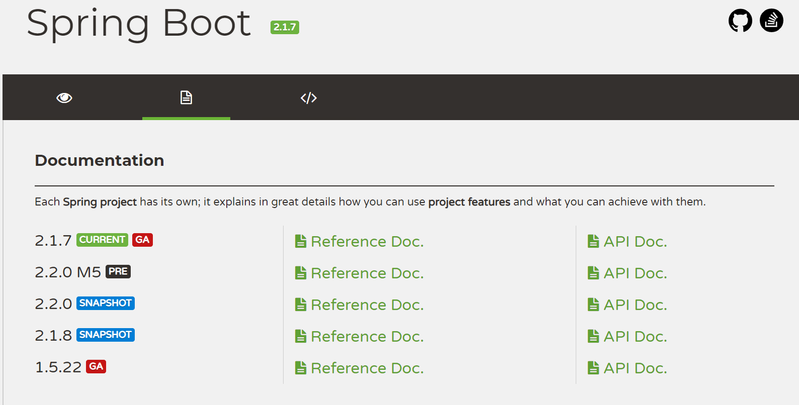
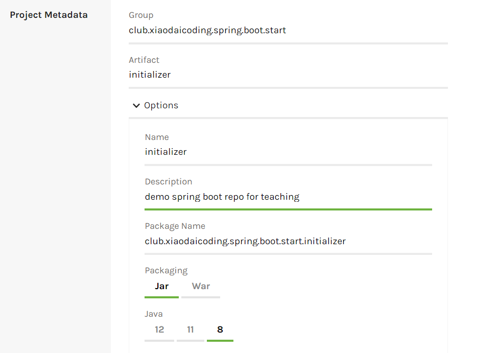
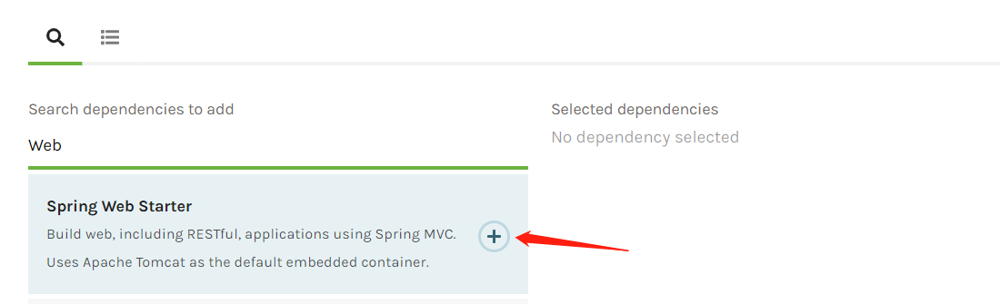
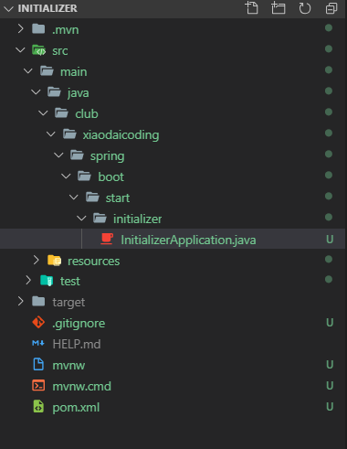
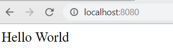

# 构建第一个 Spring Boot 应用

> 搭建一个基本的 Spring Boot 应用,是极其简单的,这也正是 Spring Boot 解决的一个痛点, 这节我们将用 Spring Initializer 快速生成 Spring Boot 应用,并运行。我们使用的开发环境是 Visual Studio Code。

##  Spring Initializer

### 选择版本

Spring Initializer 是帮助我们快速生成 Spring Boot 项目的工具，它是以 Web 网站的形式对外提供的，但是它的 API 也是公开的，因此我们可以在各种 IDE 平台，编辑器平台中见到它的身影。

打开网站 [https://start.spring.io/](https://start.spring.io/), 进入首页:



构建工具我们选择 **Maven**，**Gradle** 比较新，但是目前 **Maven** 在 **Spring** 项目构建时仍然是主流。

语言我们选择 **Java** ，我们看到，**Spring** 框架并不是只支持 **Java** 的，它还支持 **Kotlin** 和 **Groovy**。

**Spring Boot** 版本我们选择最新稳定版，也就是 2.1.7 版。

关于 Spring 项目的版本，很多同学有点摸不着头脑，我们去官网看，会看到这个：



这是 **Spring Boot** 的文档页面，在左侧的版本号中，我们看到了一些标签，下面对这些标签做一个解释。

**CURRENT** 表示当前版本，这个标签往往会伴随着 **GA** 标签。

**GA** 表示 General Available, 表示被广泛采用的稳定版本。

**PRE** 表示 Preview ，预览版本，还没正式发布，各项功能还未开发完全。

**M5** M 表示 Milestone，也就是开发阶段性进度，表示已经达到了第五个阶段性开发进度。

**SNAPSHOT** 快照，表示未发布的版本，还需要进一步测试才能正是发布，在 Maven 项目的版本号中你会经常看到这个词。

我们在学习的过程中，应该认准那个标有 **CURRENT** 和 **GA** 标签的版本，这个版本就是当前发布的最新稳定版。

接下来我们填写 Group 和 Artifact。

在任何一个包管理工具中，每个包都要有独一无二的名字，为了解决这一问题，我们的项目需要一个 Group 名，表示你的该项目的“地址”，而 Artifact 则是项目名，我们发现 Group 往往有点像倒过来的网址。

因为网址这种东西，天然就是独一无二的，假如我的个人网站是 [spring.io](spring.io),那么我就可以用 io.spring 作为我项目的一个 Group，注意这个不是必须，而是一种习惯性做法。

那么我们分别将 `club.xiaodaicoding.spring.boot.start` 和 `initializer` 作为 Group 名和 Artifact 名。

这个 Group 名首先表示它是隶属于 `club.xiaodaicoding` 下, 表示归我所有, `spring` 表示项目归为 **Spring** 这个大类中, 接下来是 **boot**, 表示是 **Spring Boot** 的内容, **start** 表示这个章节,而 **initializer** 是这节的内容,构建应用。

我们也看到了，Group 和 Artifact 的作用主要让项目包的名字唯一，然后对项目进行归纳分类。

接下来点下方的 **Option** 按钮:



填写描述，选择 Java 版本，我们选择最广泛采用的 **Java 8**，打包方式选择 **Jar**。

## 选择依赖

我们只是最基本的一个应用，因此只添加一个 `spring-boot-starter-web`.



点击加号完成添加，点击下方按钮，生成项目，自动开始下载。

使用 VSCode 打开该文件夹：



可以看到我们的 Group 名对应于文件夹的结构。

* `pom.xml`: **Maven** 的清单文件，里面包含的项目的基本配置，依赖信息，是 **Maven** 项目的核心文件。
* `.gitignore`: 因为 Git 工具是对源代码的版本控制,因此,编译生成的字节码,IDE/Editor生成的配置文件等,都不应进入到版本控制中,这个文件声明的文件/文件夹会被 **Git** 忽略。
*  `mvnw/mvnw.cmd` 是 **Maven** 工具的 Wrapper tool,即便你本地环境中没有 **Maven**, 运行该脚本,也会为你自动下载一个对应版本的 **Maven** 工具。因此，我们无需自己下载和配置 **Maven**。
* `target` 编译生成的 bytecode 等 .class 文件默认会进入到这个文件夹中,最后生成的 `jar` 包也会进入其中。
* `src`: 即 source,源代码之意，包含了所有源代码。
* `.mvn`: 装有 `maven downloader` 和下载后的 `maven-wrapper`, 如果本地环境中没有 `maven`,它会派上用场。
* `test`: 测试文件。

现在我们在 `initializer` 文件夹中再创建一个文件,命名为 `example.java`。

编辑如下内容：

```java
package club.xiaodaicoding.spring.boot.start.initializer;

import org.springframework.web.bind.annotation.RequestMapping;
import org.springframework.web.bind.annotation.RestController;

/**
 * example
 */
@RestController
public class example {

    @RequestMapping("/")
    public String helloworld() {
        return "Hello World";
    }
    
}
```

然后按 `ctrl + `\` ,打开集成终端，输入命令  `mvnw spring-boot:run` ( Windows用户) 或 `./mvnw spring-boot:run` (Mac/Linux用户)。

等待片刻，终端会输出如下信息 (部分)：

```cmd
2019-08-28 13:47:00.459  INFO 16056 --- [           main] o.s.b.w.embedded.tomcat.TomcatWebServer  : Tomcat started on port(s): 8080 (http) with context path ''
2019-08-28 13:47:00.478  INFO 16056 --- [           main] c.x.s.b.s.i.InitializerApplication       : Started InitializerApplication in 3.572 seconds (JVM running for 20.91)
2019-08-28 13:48:57.536  INFO 16056 --- [nio-8080-exec-2] o.a.c.c.C.[Tomcat].[localhost].[/]       : Initializing Spring DispatcherServlet 'dispatcherServlet'
2019-08-28 13:48:57.537  INFO 16056 --- [nio-8080-exec-2] o.s.web.servlet.DispatcherServlet        : Initializing Servlet 'dispatcherServlet'
2019-08-28 13:48:57.548  INFO 16056 --- [nio-8080-exec-2] o.s.web.servlet.DispatcherServlet        : Completed initialization in 10 ms
```

第一个语句表示 **Tomcat** 在端口 **8080** 运行，最后一个语句表明应用初始化完成。

上述日志中出现了几个词：`DispatcherServlet`, `Servlet` 等,关于这些概念,在 [Spring Framework 核心概念](SpringFrameworkConcepts/README.md) 中有讲述，不懂没关系。

接下来，打开你的浏览器，在地址栏输入 `localhost:8080`,你会看到一个大写的 **Hello World**。



恭喜你！你运行了人生中第一个 **Spring Boot** 项目,接下来的旅程会更加精彩。
